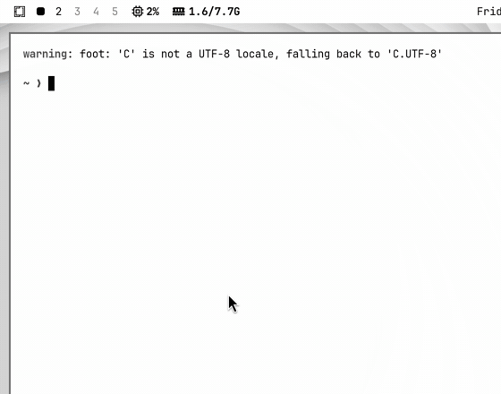
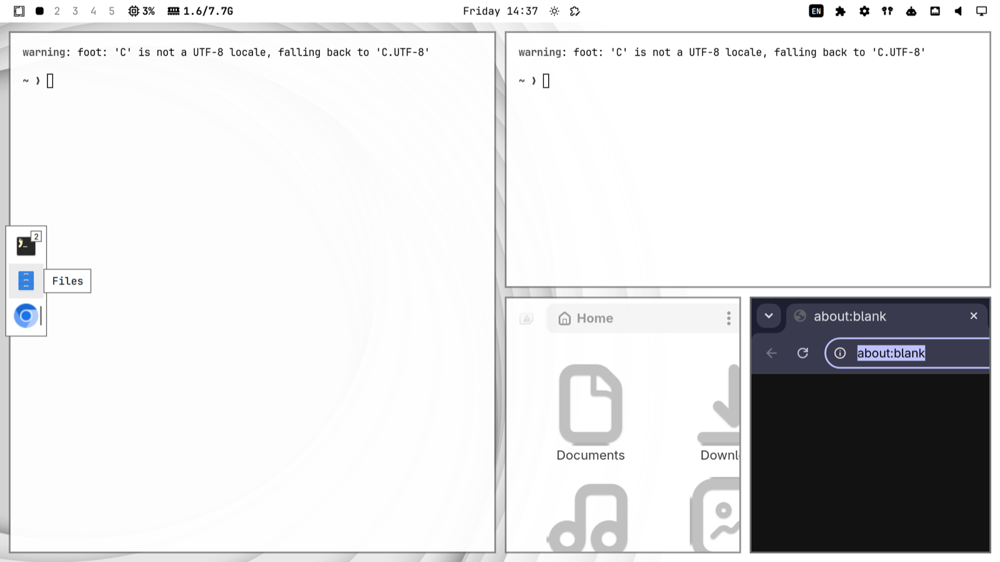
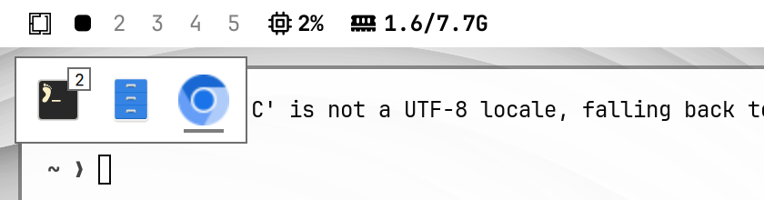
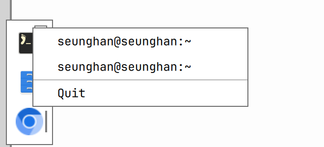

# Glance Dock

[English](README.md) · [한국어](README.ko.md) · [日本語](README.ja.md) · [简体中文](README.zh-CN.md) · **Español** · [Deutsch](README.de.md) · [Français](README.fr.md) · [Português (BR)](README.pt-BR.md) · [Русский](README.ru.md)

Por **Seunghan** ([@seunghan91](https://github.com/seunghan91)) · [Página del proyecto](https://seunghan.xyz/omarchy/glance-dock/) · [omarchyplugins.com](https://omarchyplugins.com/plugin.html?id=io.github.seunghan91.glance-dock)

Un dock de aplicaciones abiertas para el shell de Omarchy. Deja el puntero
sobre la barra, a la izquierda del reloj, y justo debajo aparece una fila de
iconos de aplicaciones: sobre el número de un espacio de trabajo muestra las
ventanas de ese espacio; en cualquier otro punto de la zona muestra las del
espacio enfocado. Un dock de borde opcional, al estilo de Apple, a la
izquierda, a la derecha o en la parte inferior de la pantalla, lista todas las
aplicaciones abiertas de todos los espacios de trabajo. Ambos docks comparten
un mismo menú de clic derecho con las ventanas de la aplicación y Quit / Force Quit.





| Dock al pasar el puntero por la barra | Menú de clic derecho |
|---|---|
|  |  |

## Características

- **Dock al pasar el puntero por la barra.** El widget no ocupa espacio propio;
  vigila toda la superficie de la barra desde su borde izquierdo hasta el
  reloj. Si la barra no tiene reloj, la zona es el 40 % izquierdo de la barra.
- **Vista previa por espacio de trabajo.** Al pasar el puntero por el número de
  un espacio de trabajo se muestran sus aplicaciones; al moverse a lo largo de
  los números, el dock cambia en vivo. Con el puntero en la barra fuera de los
  números, si se cambia de espacio de trabajo con el teclado mientras el dock
  está abierto, este sigue al nuevo espacio.
- **Dock de borde (opcional).** Todas las ventanas abiertas de todos los
  espacios de trabajo, en el borde izquierdo, derecho o inferior. `autohide` lo
  desliza hacia dentro cuando el puntero toca el borde; `pinned` lo mantiene
  visible y reserva su espacio para que las ventanas en mosaico se aparten.
- **Un icono por aplicación.** Varias ventanas de la misma aplicación comparten
  un icono con una insignia de recuento. Al hacer clic en un icono se enfoca
  una ventana; al hacer clic de nuevo se recorren las ventanas de esa
  aplicación.
- **Marcador activo y tooltips.** La aplicación propietaria de la ventana
  enfocada muestra una línea de acento; al dejar el puntero 400 ms sobre un
  icono aparecen su nombre y el número de ventanas.
- **Menú de clic derecho** con las ventanas de la aplicación (la activa va
  marcada) y después **Quit**. Mantén pulsada **Alt** con el menú abierto para
  convertirlo en **Force Quit**.
- **Gestión del desbordamiento.** Las filas largas se desplazan con la rueda
  del ratón y muestran un recuento `+N` para los iconos que quedan fuera.
- **Los iconos siguen a la barra.** El tamaño del icono es la altura de la
  barra x 1,08, escalado por el ajuste Icon size, de modo que sigue la escala
  de interfaz de Omarchy.

## Instalación

```bash
omarchy plugin add https://github.com/seunghan91/omarchy-glance-dock --enable
```

El widget declara `left` como sección predeterminada. No dibuja nada en la
propia barra, así que su posición dentro de la sección no importa. Para
moverlo de todos modos:

```bash
omarchy bar move io.github.seunghan91.glance-dock --section left
```

## Actualización

```bash
omarchy plugin update
```

`omarchy plugin update` descarga los plugins instalados, muestra un diff y
avanza con fast-forward.

## Desinstalación

```bash
omarchy plugin remove io.github.seunghan91.glance-dock
```

## Ajustes

Cámbialos en los ajustes del widget en la barra de Omarchy.

```bash
omarchy bar set io.github.seunghan91.glance-dock edgeDock right
omarchy bar set io.github.seunghan91.glance-dock edgeMode pinned
omarchy bar set io.github.seunghan91.glance-dock hoverDelayMs 150 --json
```

| Clave | Valores | Predeterminado | Significado |
|---|---|---|---|
| `iconScale` | `small`, `normal`, `large` | `normal` | Escala los iconos por 0,85, 1 o 1,2 sobre la altura de la barra x 1,08. |
| `hoverDelayMs` | 0 – 1000 (paso de 50) | `250` | Cuánto tiempo debe reposar el puntero sobre la barra antes de que se abra el dock. |
| `edgeDock` | `off`, `left`, `right`, `bottom` | `left` | Dónde se sitúa el dock de borde, u `off` para usar solo el dock de la barra. |
| `edgeMode` | `autohide`, `pinned` | `autohide` | `autohide` desliza el dock de borde hacia dentro cuando el puntero toca el borde de la pantalla (150 ms) y lo oculta 300 ms después de que el puntero se va. `pinned` lo mantiene visible y reserva su ancho para que las ventanas en mosaico se aparten. |

## Uso

- **Abrir el dock:** deja el puntero en cualquier punto de la barra a la
  izquierda del reloj durante el retardo configurado. Sobre el número de un
  espacio de trabajo ves las aplicaciones de ese espacio; en el resto de la
  zona, las del espacio enfocado. El dock permanece abierto mientras el puntero
  está en la zona o en el dock, y se cierra 120 ms después de que sale de
  ambos.
- **Enfocar una ventana:** clic izquierdo en un icono. Haz clic de nuevo para
  recorrer las demás ventanas de la aplicación. Desde el dock de borde, esto
  también cambia al espacio de trabajo de la ventana.
- **Clic derecho en un icono** para abrir el menú: haz clic en el título de una
  ventana para enfocarla, o en **Quit** para cerrar las ventanas que figuran en
  el menú — en el dock de la barra son las ventanas de la aplicación en ese
  espacio de trabajo; en el dock de borde, las de todos los espacios.
- **Force Quit:** con el menú abierto, mantén pulsada **Alt** — Quit pasa a ser
  Force Quit. Suelta Alt para volver.
- **Cerrar el menú:** pulsa **Esc** o haz clic en cualquier lugar fuera de él.

## Cómo funcionan Quit y Force Quit

- **Quit** pide a cada ventana de la aplicación que se cierre, igual que si se
  cerraran con el teclado, de modo que las aplicaciones aún pueden avisar sobre
  trabajo sin guardar.
- **Force Quit** busca el ID de proceso de cada ventana con `hyprctl clients -j`
  y `jq`, y le envía **SIGKILL**. El trabajo sin guardar de ese proceso se
  pierde, y si varias ventanas comparten un proceso (habitual en navegadores y
  terminales), todas se cierran.

## Limitaciones conocidas

- Mantener Alt pulsada *antes* del clic derecho no se detecta, así que el menú
  se abre como Quit. Pulsa Alt cuando el menú ya esté abierto.
- Varios monitores: un clic en cualquier parte de otro monitor también cierra
  el menú abierto, como en macOS.
- Solo hay un menú abierto a la vez en todos los monitores; abrir uno cierra el
  otro.

## Requisitos

- Omarchy con el shell basado en Quickshell y compatibilidad con plugins
  (widgets de barra).
- Hyprland 0.56 (enfocar y cerrar ventanas usan la sintaxis del dispatcher de
  Lua, `hl.dsp.*`).
- `hyprctl` (incluido con Hyprland), `jq` (Force Quit), `bash` y `find`
  (búsqueda de iconos). Todos están presentes en una instalación estándar de
  Omarchy.

## Privacidad y seguridad

- Sin acceso a la red. Los únicos comandos externos son `hyprctl` (enfocar,
  cerrar, posición del cursor, lista de clientes), un escaneo local de los
  directorios de iconos XDG y de `/usr/share/pixmaps`, y `kill -KILL` para
  Force Quit.
- No escribe ni modifica ninguno de tus archivos de configuración. El modo
  pinned reserva espacio de pantalla mediante la zona exclusiva de layer-shell
  solo mientras el dock está en ejecución.
- Las direcciones de ventana se validan como hexadecimales antes de llegar a un
  comando de shell.
- Force Quit envía SIGKILL al proceso de la ventana; véase más arriba.

## Autor

Diseñado y desarrollado por **Seunghan** — GitHub [@seunghan91](https://github.com/seunghan91), [seunghan.xyz](https://seunghan.xyz/omarchy/).
Se agradecen los issues y los pull requests.

## Licencia

[MIT](LICENSE) © 2026 seunghan91
